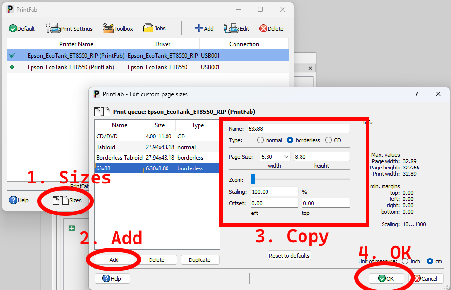
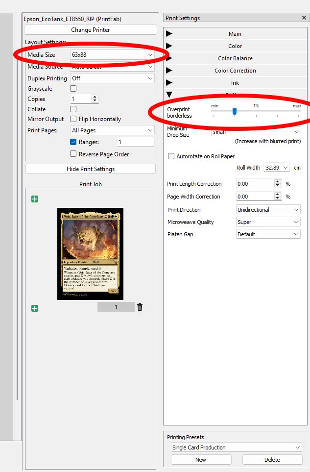
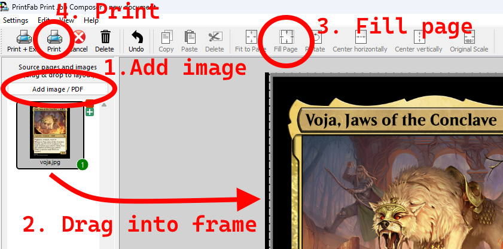

# Print Compensation

This script compensates for a print transform by applying a fixed inner-bleed crop, optional offset translation, and a rotation around the crop center.

## What this script does

This script compensates a source image for a print transform by applying a fixed inner-bleed crop, a translation in millimeters, and a rotation around the crop center.

The output is intended to be placed into PrintFab Composer as the final artwork for a single-card print job.

## Example usage

```powershell
python .\print_compensation.py \
  --source "C:\path\to\input.jpg" \
  --output "C:\path\to\output.png" \
  --offset-x -0.225 \
  --offset-y 0 \
  --bleed-mm 1.6 \
  --rotation 0.35 \
  --dpi 300
```

## Parameter reference

- `--source`: input image path
- `--output`: output image path
- `--offset-x`: horizontal offset in millimeters, converted to pixels using DPI
- `--offset-y`: vertical offset in millimeters, converted to pixels using DPI
- `--bleed-mm`: bleed on each side in millimeters
- `--rotation`: rotation in degrees in image coordinates. Positive values appear counterclockwise in the displayed image because Y points downward.
- `--dpi`: optional DPI override. If omitted, the script tries to infer DPI from the image size

## DPI detection

If `--dpi` is not provided, the script estimates DPI from the image size using the assumed physical print size of 69 mm x 94 mm.

## Tuning the transform

- If the image looks too heavy on the left, reduce `--offset-x`.
- If it looks too heavy on the right, increase `--offset-x`.
- If it looks too heavy on the top, reduce `--offset-y`.
- If it looks too heavy on the bottom, increase `--offset-y`.
- If it needs to rotate counterclockwise, increase `--rotation`.
- If it needs to rotate clockwise, decrease `--rotation`.

## PrintFab workflow

Use the compensated output in the following way:

1. Create a custom media page

   In PrintFab, open the page-size editor and add a custom media size for the card format. The example setup uses a 63x88 borderless page.

   

2. Configure the print profile

   Select the 63x88 borderless profile and set the printer profile to the correct card settings for the job.

   

3. Add the image and prepare it for printing

   In PrintFab Composer, click Add Image / PDF, drag the compensated image into the card frame, and press Fill Page. This automatically centers the artwork and fills the page without additional manual scaling.

   

   In other words, the script creates the final artwork layer, and PrintFab is then used only to place it on the correct card-sized borderless page and print it.

## Notes
- Offsets are in millimeters, not pixels.
- Bleed is a per-side value in millimeters.
